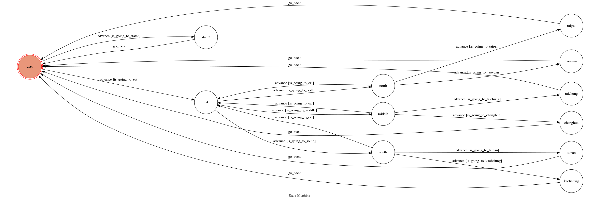
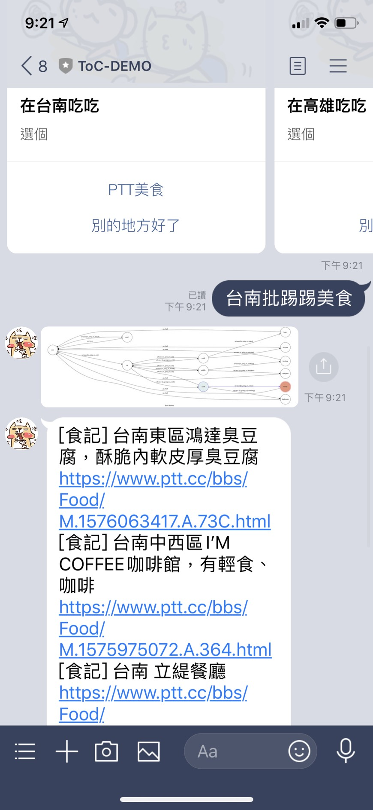
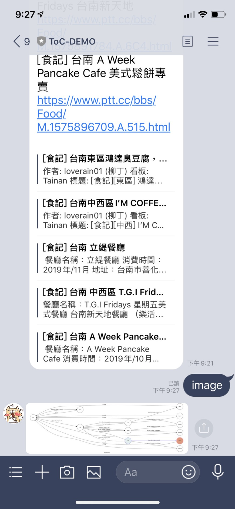
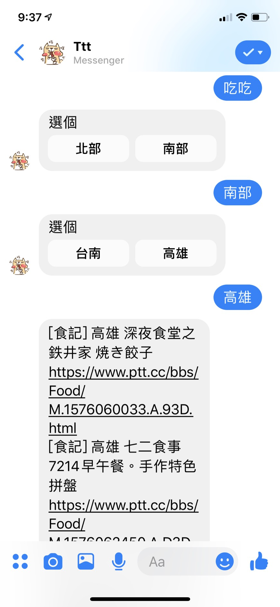

# TOC Project 2020 好想吃吃

Template Code for TOC Project 2020

A Line bot based on a finite state machine

More details in the [Slides](https://hackmd.io/@TTW/ToC-2019-Project#) and [FAQ](https://hackmd.io/s/B1Xw7E8kN)

## Setup

### Prerequisite
* Python 3.6
* Pipenv
* Facebook Page and App
* HTTPS Server

## Finite State Machine

## QR CODE

## Usage

The initial state is set to `user`.

Every time `user` state is triggered to `advance` to another state, it will `go_back` to `user` state after the bot replies corresponding message.

* initail state: user
	## 點選選單吃吃吃 會自動輸入吃吃
	* Input: "吃吃"
	  * state: eat
	  * title: "吃吃 choose"
	  * Reply: 三個按鈕:
	  	1. 北部 
	  	2. 中部 
	 	3. 南部

		* Input: 選擇按鈕 "北部"
		  * state: north
		  * Reply: 兩個圖文選單  
		  	* 選單1 
				title: "在台北吃吃 選個"\
				兩個按鈕: 
				1. PTT美食
				2. 別的地方好了
			* 選單2
				title: "在桃園吃吃 選個"\
				兩個按鈕: 
				1. PTT美食
				2. 別的地方好了
		

		* Input: 選擇按鈕 "中部"
		  * state: middle
		  * Reply: 兩個圖文選單  
		  	* 選單1 
				title: "在台中吃吃 選個"\
				兩個按鈕: 
				1. PTT美食
				2. 別的地方好了
			* 選單2
				title: "在彰化吃吃 選個"\
				兩個按鈕: 
				1. PTT美食
				2. 別的地方好了

		* Input: 選擇按鈕 "南部"
		  * state: south
		  * Reply: 兩個圖文選單  
			* 選單1 
				title: "在台南吃吃 選個"\
				兩個按鈕: 
				1. PTT美食
				2. 別的地方好了
			* 選單2
				title: "在高雄吃吃 選個"\
				兩個按鈕: 
				1. PTT美食
				2. 別的地方好了

				* Input: 選擇按鈕 "PTT美食"
					* state: tainan, kaohsiung, taichung, changhua, taipei, taoyuan
					* Reply: 台南, 高雄, 台中, 彰化, 台北, 桃園 的批踢踢美食資訊
				
				* Input: 選擇按鈕 "別的地方好了"
					* state: eat
					* Reply: 回到eat選單
		
		* Input: "image"
			* state: eat
			* Reply: show fsm圖
	
	# 除了line也有messager 簡易版本!!
	
			

			